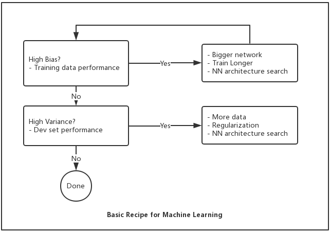

# Course 2 - Improving Deep Neural Networks
Improving Deep Neural Networks: Hyperparameter tuning, Regularization and Optimization

## Setting up Machine Learning Application
* Train / Dev / Test Set Size

|-| Train | Dev | Test|
|---|---|---|---|
|Common Practice #1 | 70% | 30% | 0 |
|Common Practice #2 | 60% | 20% | 20% |
|Big Data | 98% | 1% | 1% |

* Bias / Variance

Example | High Variance | High Bias | High Variance & High Bias | Low Bias & Low Variance
|---|---|---|---|---
Training Set Error | 1% | 15% | 15% |0.%
Dev Set Error | 11% | 16% | 30% | 1%

* Basic Recipe for Machine Learning

## Regularizing - Prevent Overfitting

* L2/Frobenius Regularization (hyper parameter: λ = regularization paramter)
* L1 Regluarization (less common)
* Dropout Regularization
* Data augmentation
* Early Stopping

## Optimization
* Normalizing inputs
* Weight Initialization: partially solve Vanishing/Exploding gradients problem
    * Xavier initialization
    * ...
* Gradient checking: using numerical approximation of gradients
    * Don't use in training - only to debug, it is much too slow
    * If algorithm fails grad check, look at components to try to identify bug
    * Remember regularization
    * Doesn't work with dropout
    * Run at random initialization; perhaps again after some training

### Optimization Algorithms
#### :bulb: Mini-batch Gradient Descent
Use Batch with large data is too slow because for each gradient descent step you need go through the whole data set

Mini-batch Size | Gradient Descent | Optimizing Cost Function | Tips
---|---|---|---
1 | Stochastic Graient Descent (every example is its own mini-batch)   (X{1}, Y{1}) = (X(1), Y(1))  (X{2}, Y{2}) = (X(2), Y(2)) ... | extremely noisy, won't ever converge *lose speed up from vectorization* |
(1, m) | Mini-batch Gradient Descent | In practice, fartest learning 1. vectiorization,  2. make progress without procesing entire training set | 1. Typical mini-batch size: 64, 128, 256, ...  2. Make sure mini-batch fits in CPU/GPU memory
m | Batch Gradient Descent - (X{1}, Y{1}) = (X, Y) | low noise, large steps,  *too long per iteration* | Use Batch if training set is small, m <= 2000

#### :bulb: Bias Correction
Bias correction in exponentially weighted averages - during the initial phase of learning when warming up the estimates the bias correction can help to obtain a better estimate

#### :bulb: Gradient Descent With Momentum
The basic idea is to compute an exponentially weighted average of your gradients, and then use that gradient to update your weights instead.

*For iteration t, compute dW, db using current mini-batch and then do gradient descent as formula shown below:*

  

* **Hyperparameters**: α(learning rate), β = 0.9

#### :bulb: RMSprop

*For iteration t, compute dW, db using current mini-batch and then do gradient descent as formula shown below:*

   

* **epsilon** is used to prevent the denominator to be zero

#### :bulb: Adam Optimization Algorithm
Adam algorithm combines the Momentum and RMS algorithms togather.

*Initialize vdW=0, SdW=0, vdb=0, Sdb=0,  For iteration t, compute dW, db using current mini-batch and then do the gradient descent as formula shown below:*

           

* **Hyperparameters**

Hyperparameters | Choices
---|---
α|needs to be tune
β1|0.9 (dW)
β2|0.99 (dW2)
ε|10-8

#### :bulb: Learning Rate Decay
* Formula decay

Formula | Remarks
---|---
|
|exponentially decay
| k is a hyperparameter, t is the current iteration
learning rate decreases in discrete steps, descrease by one half after a while|

Note: 1 epoch = 1 pass through data
* Manual decay

## Hyperparameter Tunning
* Try random values, don't use a grid
* Using an approprate scale to pick hyperparameters
    * For learning rate *α*, searching value through logarithmic scale(0.0001, 0.001, 0.01, 0.1, 1) is much appropriate than a linear scale(0.0001, 0.0002, ...)
    * Hyperparameters for exponentially weighted averages *β = 0.9, ..., 0.999*, it doesn't make sense to sample on the linear scale(why?), so the best way is to explore the range of *(1 - β) = 0.1, 0.01, 0.001*
        * For formula 1 / 1- β, it is very sensitive to small changes in β, when β is close to 1
* Two main approach for searching hyperparameters

Approach | When to use | How
--- | --- | ---
:panda_face: Pandas: Babysitting one model | having huge data set, limited computational capacity | babysitting the model one day at a time
:tropical_fish: Caviar: Training many models in parallel | having enough computational resources| Train multiple models at the same time

## Batch Normalization - Normalizing activations
Given some intermediate values in NN, do the normalization as described below:

  
  
  
And then use z_tilde isntead of z, and keep the cache of these gammas and betas of each layer

### Batch Norm as Regularization
Each mini-batch is scaled by the mean/variance computed on just that mini-batch. This adds some noise to the value z[l] within that minibatch. So similar to dropout, it adds some noise to each hidden layer's activations. This has a slight regularization effect.  

*Because the noise added is quite small, this is not a huge regularization effect, and you might choose to use batch norm together with dropout, and you might use batch norm together with dropouts if you want the more powerful regularization effect of dropout.*

## Multi-class Classification
* [Softmax Regression](http://ufldl.stanford.edu/tutorial/supervised/SoftmaxRegression/)

## References
* [Coursera - Improving Deep Neural Networks](https://www.coursera.org/learn/deep-neural-network/home/welcome)
* [UFLDL Tutorial - Softmax Regression](http://ufldl.stanford.edu/tutorial/supervised/SoftmaxRegression/)
