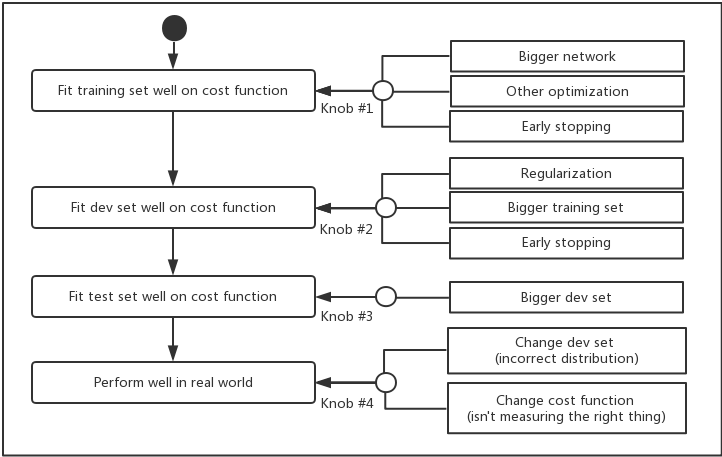

# Course 3 - Structuring Machine Learning Projects
## Orthogonalization
:pushpin: Orthogonalization Process for ML

## Evaluation Metric
#### Single number evaluation metrics
Metric | Definition
--- | ---
Precision | True Positive / (True Positive + False Positive)
Recall | True Positve / (True Positive + False Negative)
F1 Score | 2 * Precision * Recall / (Percision + Recall)

#### Satisficing and Optimizing Metrics
Type | Definition
--- | ---
Optimizing Metric | the metric you want to maximize
Satisficing Metric | it has just to be good enough

:chestnut: **Example**

Classifier | Accuracy | Running time | -
--- | --- | --- | ---
A | 90% | 80ms |
B | 92% | 95ms | :heavy_check_mark:
C | 95% | 1500ms |

>Cost = accuracy - 0.5 * runningTime 
>Suppose You want to maximize accuracy and subject to running time <= 100ms, so the Accuracy is the optimizing metric and runnint time is the satisficing metric here.

## Train/Dev/Test Distribution
* Choose a dev set and test set to reflect data you expect to get in the future and consider important to do well on.
* Ensure your dev set and test set from the **SAME** distribution.

**Note: When to change dev/test set distribution or your evalution metrics?**

When your evaluation metric is no longer correctly rank ordering preferences between algorithms, that's a sign that you should change your evalution metric or perhaps your dev set or test set.

## Human-level Perfomance
### Why compare to human-level performance?

So long as ML is worse than humans, you can:
* Get labeled data from humans
* Gain insight from manual error analysis: why didi a person get this right?
* Better analysis of bias/variance

### What is Avoidable Bias?
**Bayse Optimal Error**: the perfomance approaches but never surpasses this theoretical limits

**Using Human-level error as a proxy for Bayes error.**

:chestnut: **Example**

Error | #1 | #2
--- | --- | ---
Humans (≈ Bayes)| 1% | 7.5%
Training Set | 8% | 8%
Dev Set | 10% | 10%
**-**| Focus on **bias** (between humans/train) | Focus on **variance** (between train/dev) 

* **Avoidable bias** - the difference between humans error and training set error
* **Variance problem** - the difference between training set error and dev set error

### How to Reducing Bias & Variance?

Error | Tactics
---|---
Avoidable Bias | Train bigger model  Train longer/better optimization algorithms  NN architecture/hyperparameters search
Variance Problem | More data  Regularization

## Error Analysis
### How to address data mismatch?
1. Carry out manual error analysis to try to understand difference between training and dev/test sets
2. Make training data more similar; or collect more similar to dev/test sets
    * Artificial data synthesis

## Transfer Learning
Transfer Learning focuses on storing knowledge gained while solving one problem and applying it to a different but related problem.

:chestnut: **Example**
>You have a trained neural network for image recognition task, you train all of the usual parameters for the neural network, all the weights and layers, and you now having something that learns to make image recognition predictions. 
Now, what you want to do tranfer learning is to retrain the neural network on a new radiology data set.

There are two options for retrain:
1. When you only have a small radiology dataset, you can just retrain the weights of the last layer
2. If you have enough data, you can retrain all the parameters in the network. If you do so, then we can seperate the whole trainig procss into two phase:
    * Pre-training: use image recognitions data to pre-initialize or really pre-train the weights of the NN
    * Fine tunning: training on the radiology data after you update all the weight

*You've taken knowledge learned (low level features such as detecting edges, curves or positive objects, etc.) from image recognition and applied it or transferred it to radiology diagnosis.*

### When does transfer learning make sense?
Transfer learning makes sense when you have a lot of data for the problem you're transferring from and usually relatively less data for the problem you're transferring to.

If you're trying to learn from some Task A and transfer some of the knowledge to some Task B, then transfer learning makes sense when Task A and B have the same input X. In previous example, A and B both have images as input. 

Transfer learning will tend to make more sense if you suspect that low level features from Task A could be helpful for learning Task B. And in the earlier examples, maybe learning image recognition teaches you enough about images to have a radiology diagnosis.

## Multi-task Learning
In multi-task learning, you have one neural network do several things at the same time.

:chestnut: **Example**
>Building a NN to tell you does each image have four different kinds(pedestrians, cars, traffic lights, stop signs) of objects in it.

### When does multi-task learning make sense?
* Traning on a set of tasks that could benefit from having shared lower-level features
* Usually: Amount of data you have for each task is quite similar 
* Can train a big enough neural network to do well on all the tasks(If it is not big enough, then it may hurt the performance)

## End-to-end Deep Learning
In contrast to a pipelien with a lot of stages to solve a problem, an end-to-end deep learning train a huge neural network to just take the input and directly output the final result you want.

### Whether to use end-to-end deep learning?

**Pros and cons of end-to-end deep learning**

:heart: Pros | :broken_heart: Cons
--- | ---
Let the data speek | May need large amount of data
Less hand-designing of componets needed | Excludes potentially useful hand-designed components

:key: **Key question**

**Do you hanve sufficient data to learn a function of the complexity needed to map x to y?**